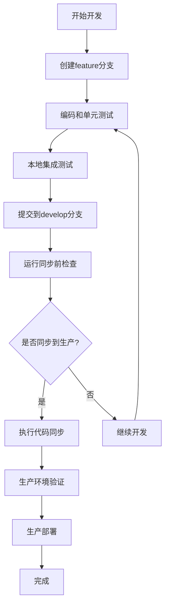
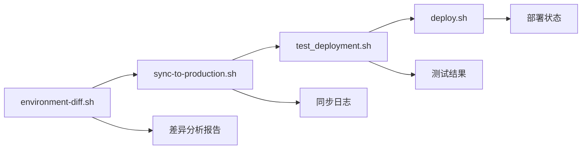

# 📋 项目管理和环境同步策略

> **ChainReactions Backend 企业级项目管理方案**
> 适用于多环境微服务架构的专业开发流程

---

## 🎯 项目管理概览

### 核心原则

1. **分离开发，验证同步** - 保持开发和生产环境的独立性
2. **标准化配置** - 统一技术栈和部署配置
3. **自动化流程** - 减少人为错误，提高效率
4. **质量保证** - 多层次验证确保代码质量
5. **可追溯性** - 完整的变更记录和回滚能力

### 环境架构

```
Development Environment (chainreactions_backend)
    ↓ 专业同步工具
Production Environment (chainreactions_backend_railway)
    ↓ 一键部署
DigitalOcean Docker Production
```

---

## 🏗️ 环境管理策略

### 环境定位

#### 开发环境 (`chainreactions_backend`)
- **用途**: 功能开发、单元测试、集成测试
- **特点**:
  - 快速迭代，最新功能
  - 完整的开发工具链
  - 灵活的配置选项
  - 丰富的调试信息

#### 生产环境 (`chainreactions_backend_railway`)
- **用途**: 生产部署、稳定性保证
- **特点**:
  - 经过验证的稳定代码
  - 完整的部署自动化
  - 生产级配置优化
  - 监控和备份机制

### 同步策略

#### 为什么要分离？
1. **风险隔离**: 开发不会直接影响生产
2. **稳定性保证**: 生产环境保持稳定可部署状态
3. **开发效率**: 开发环境可以快速试验和迭代
4. **专业分工**: 每个环境都有专门的配置和工具

#### 如何保证一致性？
1. **配置标准化**: 统一的Docker、Node.js、依赖版本
2. **自动化同步**: 专业的同步工具和验证流程
3. **版本控制**: Git分支策略和提交规范
4. **质量门禁**: 多层次的测试和验证

---

## 🔄 标准工作流程

### 日常开发流程



### 详细步骤

#### 1. 开发阶段
```bash
# 开发环境操作
cd chainreactions_backend
git checkout develop
git checkout -b feature/new-feature

# 开发和测试
# ... 编码工作 ...
npm run test
npm run type-check

# 提交代码
git add .
git commit -m "feat: 添加新功能"
git push origin feature/new-feature
```

#### 2. 集成阶段
```bash
# 合并到开发分支
git checkout develop
git merge --no-ff feature/new-feature
git push origin develop

# 运行完整测试
./test_deployment.sh
```

#### 3. 同步决策点
```bash
# 检查环境差异
./environment-diff.sh --all

# 评估同步必要性
# - 功能是否完整？
# - 测试是否通过？
# - 是否需要立即部署？
```

#### 4. 生产同步阶段
```bash
# 执行同步（包含备份和验证）
./sync-to-production.sh

# 验证同步结果
cd chainreactions_backend_railway
./test_deployment.sh
```

#### 5. 生产部署阶段
```bash
# 提交同步的代码
git add .
git commit -m "sync: 从开发环境同步v1.2.3功能"
git push origin main

# 执行部署
./deploy.sh

# 部署后验证
./test_deployment.sh
```

---

## 🛠️ 工具和脚本体系

### 核心工具

#### 1. 环境差异检查工具 (`environment-diff.sh`)
**用途**: 分析两个环境的配置和代码差异

**功能**:
- Docker配置对比
- 代码版本检查
- 部署配置分析
- 性能和安全配置检查

**使用场景**:
- 同步前的差异分析
- 配置一致性验证
- 问题排查辅助

#### 2. 代码同步工具 (`sync-to-production.sh`)
**用途**: 安全地将开发环境代码同步到生产环境

**功能**:
- 智能文件过滤（保留生产配置）
- 自动备份生产环境
- 同步后验证
- 交互式确认流程

**安全特性**:
- 只同步业务代码，保留部署配置
- 完整的备份机制
- 多重验证检查
- 回滚能力

#### 3. 部署测试工具 (`test_deployment.sh`)
**用途**: 全面的部署后验证测试

**测试覆盖**:
- 容器健康检查
- API端点响应测试
- 服务间连通性
- 资源使用分析
- 日志错误扫描

#### 4. 一键部署脚本 (`deploy.sh`)
**用途**: 自动化的生产环境部署

**部署阶段**:
- 环境检查
- 自动备份
- 服务更新
- 健康验证
- 性能监控

### 工具关系图



---

## 📊 质量保证体系

### 多层次验证

#### 1. 开发阶段验证
- **单元测试**: 服务内部逻辑验证
- **类型检查**: TypeScript编译时检查
- **代码规范**: ESLint和Prettier检查
- **本地集成测试**: 服务间交互测试

#### 2. 同步前验证
- **环境差异检查**: 配置一致性验证
- **Git状态检查**: 提交完整性验证
- **依赖检查**: 包版本和安全性检查
- **配置验证**: Docker和环境变量检查

#### 3. 同步后验证
- **文件完整性检查**: 关键文件存在性验证
- **版本一致性检查**: Node.js和依赖版本验证
- **配置正确性检查**: 生产配置完整性验证
- **基本功能测试**: 服务启动和健康检查

#### 4. 部署后验证
- **容器健康检查**: 所有服务运行状态
- **API功能测试**: 端到端功能验证
- **性能基准测试**: 响应时间和资源使用
- **安全扫描**: 基础安全配置检查

### 质量指标

#### 开发质量指标
- 代码测试覆盖率 > 80%
- TypeScript编译无错误
- ESLint检查无严重问题
- 单元测试通过率 100%

#### 同步质量指标
- 配置差异 = 0（关键配置）
- 文件同步成功率 > 95%
- 版本一致性 = 100%
- 同步验证通过率 = 100%

#### 部署质量指标
- 服务启动成功率 = 100%
- 健康检查通过率 = 100%
- API响应成功率 > 99%
- 部署时间 < 30分钟

---

## 🚨 应急响应流程

### 常见问题和解决方案

#### 1. 同步失败
**症状**: 同步工具报告错误
**原因**: 文件冲突、权限问题、磁盘空间不足
**解决方案**:
```bash
# 检查错误日志
./sync-to-production.sh 2>&1 | tee sync.log

# 检查环境状态
./environment-diff.sh --config

# 手动解决冲突后重试
```

#### 2. 部署失败
**症状**: 部署脚本执行失败
**原因**: Docker构建错误、环境变量缺失、资源不足
**解决方案**:
```bash
# 检查部署日志
docker-compose logs [service-name]

# 回滚到备份版本
./rollback.sh [backup_directory]

# 修复问题后重新部署
./deploy.sh
```

#### 3. 服务异常
**症状**: 健康检查失败、API响应错误
**原因**: 代码Bug、配置错误、外部服务问题
**解决方案**:
```bash
# 检查服务状态
./test_deployment.sh

# 查看详细日志
docker-compose logs -f [service-name]

# 重启异常服务
docker-compose restart [service-name]
```

### 应急响应联系人

- **主要开发者**: [联系方式]
- **运维负责人**: [联系方式]
- **产品负责人**: [联系方式]
- **项目经理**: [联系方式]

---

## 📈 性能优化建议

### 开发环境优化

#### 1. 构建性能
- 使用Docker BuildKit加速构建
- 配置.npmrc使用国内镜像源
- 启用并行构建
- 优化Docker层缓存

#### 2. 开发效率
- 配置IDE热重载
- 使用Volume挂载避免重复构建
- 配置调试工具
- 优化测试执行速度

### 生产环境优化

#### 1. 部署性能
- 使用镜像仓库和缓存
- 优化Docker镜像大小
- 配置健康检查超时
- 使用蓝绿部署或滚动更新

#### 2. 运行性能
- 配置资源限制和监控
- 优化Node.js内存设置
- 配置Redis内存策略
- 设置日志轮转和清理

---

## 📚 培训和知识传承

### 团队培训计划

#### 1. 新成员培训
- 项目架构和微服务介绍
- Git工作流和协作规范
- 开发环境搭建和配置
- 常用工具使用方法

#### 2. 进阶培训
- Docker和容器化最佳实践
- CI/CD流水线配置
- 监控和故障排查
- 安全和性能优化

#### 3. 专题培训
- 新技术栈引入培训
- 业务逻辑和领域知识
- 第三方服务集成
- 生产环境运维

### 文档维护

#### 1. 技术文档
- API接口文档
- 架构设计文档
- 数据库设计文档
- 部署运维文档

#### 2. 流程文档
- 开发流程规范
- 测试流程指南
- 发布流程说明
- 应急响应手册

#### 3. 知识库
- 常见问题解答
- 最佳实践案例
- 故障处理案例
- 技术分享记录

---

## 🔮 未来改进计划

### 短期目标（1-3个月）

1. **CI/CD自动化**
   - 配置GitHub Actions流水线
   - 实现自动测试和构建
   - 集成自动化部署

2. **监控和告警**
   - 配置Prometheus监控
   - 设置Grafana仪表盘
   - 建立告警通知机制

3. **安全加固**
   - 集成安全扫描工具
   - 配置依赖漏洞检查
   - 实施安全最佳实践

### 中期目标（3-6个月）

1. **多环境支持**
   - 添加Staging环境
   - 配置环境矩阵
   - 实现环境自动同步

2. **性能优化**
   - 实施性能基准测试
   - 优化服务响应时间
   - 配置自动扩缩容

3. **开发工具链**
   - 集成更多开发工具
   - 优化开发体验
   - 提高开发效率

### 长期目标（6-12个月）

1. **云原生架构**
   - 迁移到Kubernetes
   - 实施服务网格
   - 配置云原生监控

2. **智能化运维**
   - 实施AIOps
   - 配置智能告警
   - 实现故障自愈

3. **团队协作优化**
   - 优化协作流程
   - 提高自动化水平
   - 减少人工干预

---

## 📞 支持和联系

### 获取帮助

1. **文档资源**
   - 项目Wiki页面
   - 技术文档库
   - API参考文档

2. **工具帮助**
   ```bash
   ./environment-diff.sh --help
   ./sync-to-production.sh --help
   ./test_deployment.sh --help
   ./deploy.sh --help
   ```

3. **团队沟通**
   - 技术讨论群组
   - 代码审查流程
   - 定期技术分享

### 反馈和改进

- **问题报告**: GitHub Issues
- **功能建议**: 项目Discussions
- **流程改进**: 团队会议
- **文档更新**: Pull Request

---

**文档版本**: 1.0.0
**创建日期**: 2025年10月21日
**维护团队**: ChainReactions开发团队
**审核状态**: 已审核

这个策略文档将根据项目发展和团队反馈持续更新和完善。